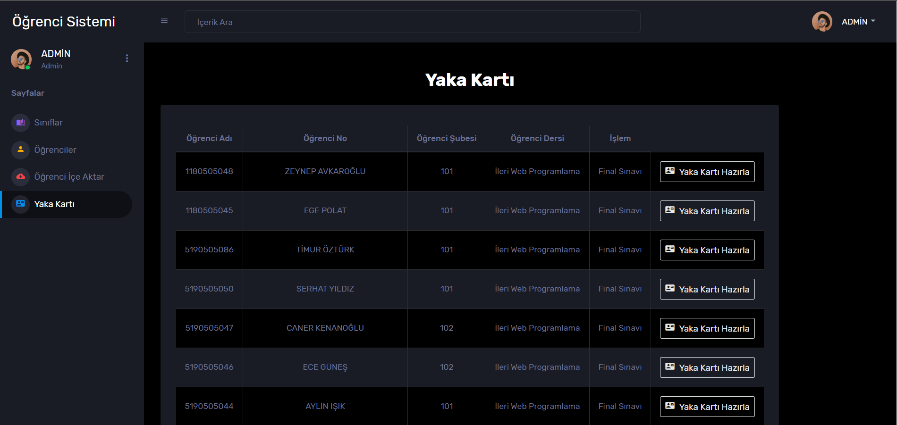

# Student-Management-System

<h3>This Student Management System is built from scratch using PHP language and MYSQL.</h3>

<h3>--> You need a user account to log into the Student System. (Don't worry, I will share this information with you for the sample project.) 

- Your user account information is kept as a <b>Password</b> in MYSQL.

<h3>--> When you log in to the system, there are links where you can quickly access the information of the classes and important pages.</h3>

<h3>--> On the Classes page, it is presented with quota information for each class and options that you can download in <b>Excell</b> format or <b>PDF</b> format, where you can access the student lists in each class.</h3>

<h3>--> On the Students page, you can manually edit or delete each student's information with the help of Modal.</h3>

<h2>There is a section on the Students page that is hidden, but to be able to see it, just activate the "Select All" button.</h2>
<h2>In this hidden place, there is a button that allows us to delete all the selected students, you can add the selected students to the selected class without exceeding the "Quota Limit", or you can randomly distribute all the selected students to the classes.</h2>

<h2>By using the "Add New Student" button, you can add students manually according to the information entered manually.</h2>

<h2>By using the "Delete" button, all information belonging to the student that is requested to be deleted is deleted from the database. (Be careful, this action cannot be undone.)</h2>

<h3>--> There are quite a lot of students in private teaching institutions or schools and it will be very difficult to enter these students manually. Here you can automatically save all student information to the database and your system by uploading "Excell" files and ".xls/.xlsx" files.</h3>

<h2>An error message is given if the uploaded file type is not supported.</h2>

<h3>--> You can create and download a Badge for each registered student.</h3>

 
<h1>An example of this project can be found at <a href="https://project.4lphasoftware.com/std">Here</a>.</h1>
- Username: admin
- Password: 159357
